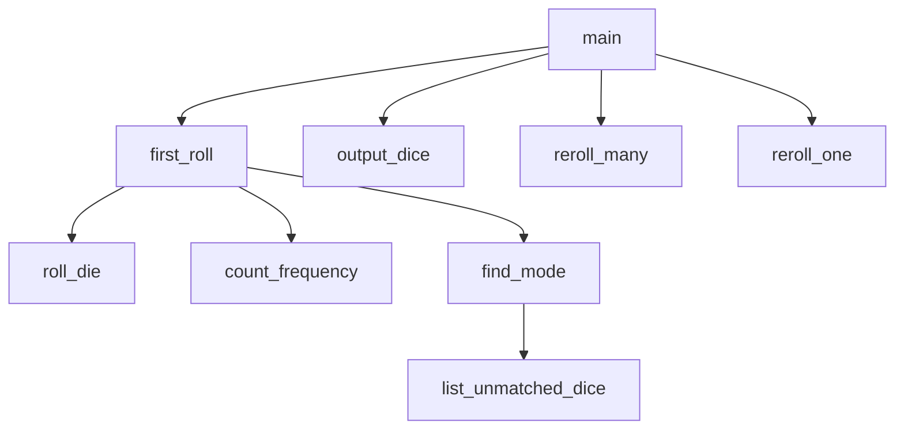

# Ezee-Dice-Game

Programmed by Tate B. & Rhett

## Description
The game will roll 12 dice to start. It will find a mode number, and then roll each dice to get each die to the mode. Each roll will output to the console. When all dice equal the mode, the game is over.

## Flowchart

## IPO Charts

### Main Rhett
| Arguments | Processing                                                      | Output/Return                                          |
| ------------------ | ------------- | ------------ |
| `none`   | Calls all functions to play the number of games specified  |         |

### output_dice Rhett
| Arguments | Processing  | Output/Return                                          |
| ------------------ | ------------- | ------------ |
| `dice`    | gets die.  |` Outputs` each die in the list|

### roll_die Rhett
| Arguments | Processing                                                      | Output/Return                                          |
| ------------------ | ------------- | ------------ |
| `none`    | Returns a random integer from 1 to 6 | `Returns` a random int from 1-6.        |

### first_roll Rhett
| Arguments | Processing                                                      | Output/Return                                          |
| ------------------ | ------------- | ------------ |
| `none`    | Uses roll_die to generate a list of 12 integers  | `Returns` a list of 12 random integers |

### count_frequency Tate
| Arguments | Processing                                                      | Output/Return                                          |
| ------------------ | ------------- | ------------ |
| `dice, number`    | Returns how often that target value occurs in the list  | <<        |

### find_mode Tate
| Arguments | Processing                                                      | Output/Return                                          |
| ------------------ | ------------- | ------------ |
| `dice`    | Uses count_frequency(dice, number) to determine how often each number occurs.  | `Returns` the mode        |

### list_unmatched_dice Tate B.
| Arguments | Processing                                                      | Output/Return                                          |
| ------------------ | ------------- | ------------ |
| `dice`    | Determines which dice need rerolled  | `Returns` a list of indexes to reroll     |

### reroll_one Tate B.
| Arguments | Processing                                                      | Output/Return                                          |
| ------------------ | ------------- | ------------ |
| `dice, index`    | Uses roll_die to reroll that index  | `Returns` a new list with that index rerolled |

### reroll_many Tate B.
| Arguments | Processing                                                      | Output/Return                                          |
| ------------------ | ------------- | ------------ |
| `dice`    | Calls list_unmatched_dice() and reroll_one() to reroll each die != the mode. | `Returns` a new list of rerolled dice |

| Arguments | Processing                                                      | Output/Return                                          |
| ------------------ | ------------- | ------------ |
| `none`    | finds a contac
